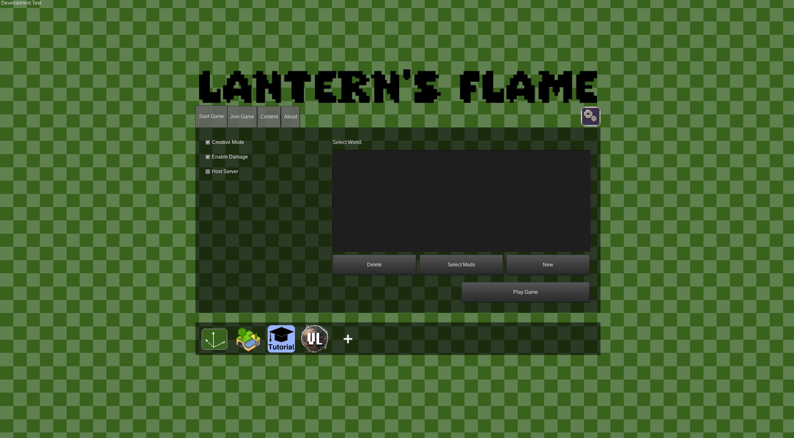

## 2024-12-06

Lots of thinking, not much coding, but that's totally OK. Built a very basic house using Wuzzy's bricks, experiemented with WorldEdit mod, poked around the issues in the Luanti repo (still named minetest/minetest). Just now added a lantern background image and icon so I can distinguish my game from devtest.

New goal is to try to rebuild from devtest so I can actually understand things. Wuzzy's tutorial was a good starting point but adds a lot of restrictions on the player and overall is not a good foundation for building a radically different game.

I've spent a lot of time thinking about the core gameplay loop. I feel like Minecraft mods miss this. I haven't seen anybody revamp the inventory experience aside from sorting and minor tweaks. I want an inventory that's less tedious, more usable, and overall less limiting. The basic idea is unlimited slots, easy-to-use filters, and more dedicated screen space to an opened inventory.

Additionally, we can do without the crafting grid. It's iconic Minecraft, but this isn't Minecraft. It was never a discoverable system, and the recipe book is bolted onto it.

In short, the core UX of Minecraft hasn't been updated since 2009, from what I can tell. Heck, it's definitely still the same as the 2011 Beta 1.3 that I first played. But that was a thrown-together game that thrived off its uniqueness and endless potential. Now that Minecraft has matured and hugely expanded its block palette, that UX has been pushed beyond its limits, and the recipe book and bundles are a bandaid on a problem that has other solutions. Minecraft is limited by its players knowledge. I'm comfortable teaching my players a new inventory and crafting paradigm.

So yeah, this game is gonna be huge and it's never gonna be done. But I'm going to keep chipping away at a demo and I'm going to do it in Luanti. I asked myself if I really needed to make a game, and as much as I wanted the answer to be no, I'm compelled to make this game. I want it to exist. I want people to be able to experience a radically re-imagined block game. Not just mods tacked onto Minecraft that break when Minecraft updates the game or its ToS. But something independent, unique, and truly free.

The dream lives on so long as I work on this game :) Who knows, maybe I'll find teammates in Mineclonia devs or elsewhere, I'm certainly not the only one trying this!

## 2024-11-10

- Update game.conf title and remove some devtest mods
- Create basic flat map for worldgen (this took hours lol)

## 2024-11-09

- Set up the game!

  

- Modified Wuzzy's tutorial world following his development.md guide, will be adapting it for my world: a small village in a valley whose gate is closed off
